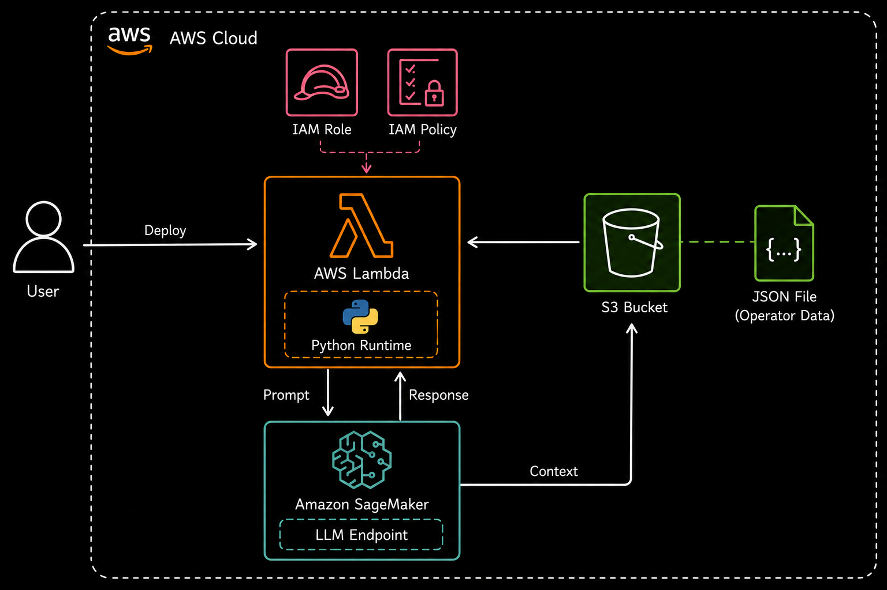

# SiegeQuery

A lightweight RAG-style assistant for Rainbow Six Siege using AWS Lambda, Amazon S3, and SageMaker-hosted LLMs.

##  Tech Stack

* AWS Lambda
* Amazon S3
* Amazon SageMaker
* IAM Roles & Policies
* Python SDK (boto3)

---

##  Overview

This project uses a serverless AWS architecture to answer questions regarding the popular tactical FPS shooter Tom Clancy's Rainbow Six Siege.

The Lambda function:

1. Receives user input
2. Reads operator data from S3
3. Builds a contextual prompt
4. Invokes a SageMaker-hosted LLM
5. Returns the generated response

---

##  Architecture



---

##  Project Structure

```text
.
├── lambda_function.py
├── rainbow_op.json
├── LICENSE
├── architecture.png
└── README.md
```

---

##  AWS Services Used

| Service   | Purpose                 |
| --------- | ----------------------- |
| Lambda    | Serverless backend      |
| S3        | Stores operator dataset |
| SageMaker | LLM inference           |
| IAM       | Access management       |

---

## Deployment

### Create S3 Bucket
Upload `rainbow_op.json`

### Deploy SageMaker Endpoint
Deploy a text-generation LLM using Amazon SageMaker

### Configure IAM Roles
Required permissions:

- `AWSLambdaBasicExecutionRole`
- `s3:GetObject`
- `s3:ListBucket`
- `sagemaker:InvokeEndpoint`

### Create Lambda Function
- Runtime: Python
- Attach IAM roles
- Paste project code

### Configure Variables

```python
Bucket="rainbow-six"
Key="rainbow_op.json"
EndpointName="meta-textgeneration-llama-2-7b"
```

## User Inputs

```json
{
  "user_input": "What does Mute do in Rainbow Six Siege?"
}

{
"user_input": "Does Tubarao's freeze work on Ying's candelas?"
}

{
"user_input": "Can Snake's radar detect Vigil?"
}

```

## Sagemaker hosted Model Response
```json
{
  "response": "Mute is a defender in Rainbow Six Siege with a 2 speed and 2 armor rating. His Signal Disruptors jam attacker gadgets such as drones, breach devices, and electronic tools within their radius. He is commonly used to deny intel and protect reinforced walls from hard breachers."
}

{
  "response": "Tubarao's Zoto Canisters can slow or temporarily disable Ying's Candelas if they pass through the freeze zone before activation. However, they do not permanently destroy the gadget like Jager's ADS or Wamai's MAG-NET systems."
}

{
  "response": "Solid Snake's radar can have difficulty detecting Vigil while his ERC-7 cloaking ability is active. Vigil disrupts electronic intel devices, making him harder to track through observation and detection tools."
}
```


---

##  License

MIT
